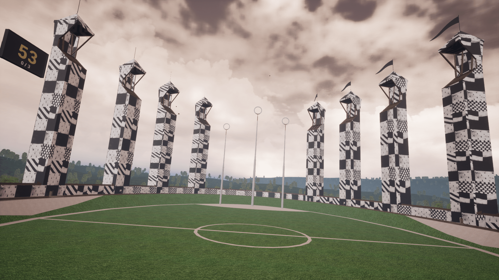
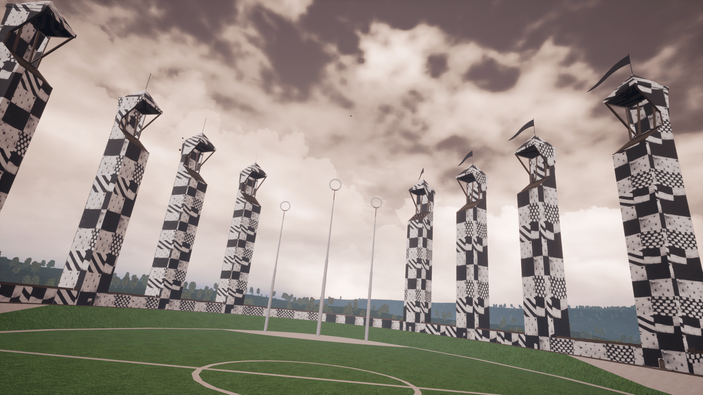
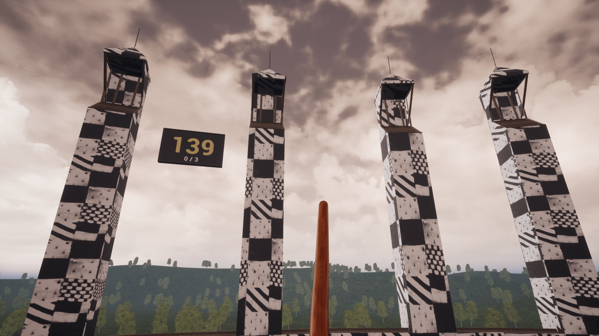
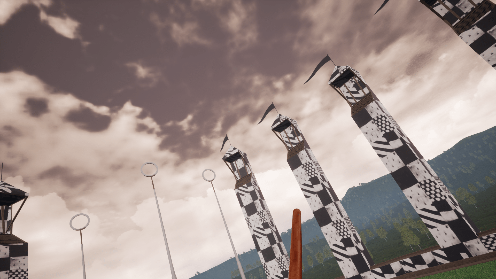

# Title
Квиддич

---

# Description

        Игровое приложение для очков виртуальной реальности и тренажера Futurift V2. Игра основа на вселенной Гарри Поттера. Во время сессии игрок, находясь в тренажере Futurift и Oculus Rift CV1, управляет метлой с помощь левого контроллера, перемещая его позицию, а правым - происходит взаимодействие с квофлом (игровым мячом). Задача игрока забить как можно больше мячей в кольцо за отведенное время.
        Кресло Futurift позволяет симулировать наклоны метлы, тем самым улучшая погружение игрока в виртуальной реальности.
        Для написания игры использовался игровой движок Unreal Engine 4 и плагин для управления креслом Futurift (данный плагин написан сотрудниками лаборатории).

# Images
* 
* 
* 
* 
---

# Videos

* https://youtu.be/ua2ugfrAVNM
---

# Tags
* VR
* Game
---
# Tech
* Unreal Engine
* С#
* C++
---
# Developers
* Калинин И.М.
---
# Site
---
# SourceCode
| name                         | link                                      |
| ---------------------------- | ----------------------------------------- |
| Исходный код                 | https://github.com/RTUITLab/Quidditch-RTU    |
---
